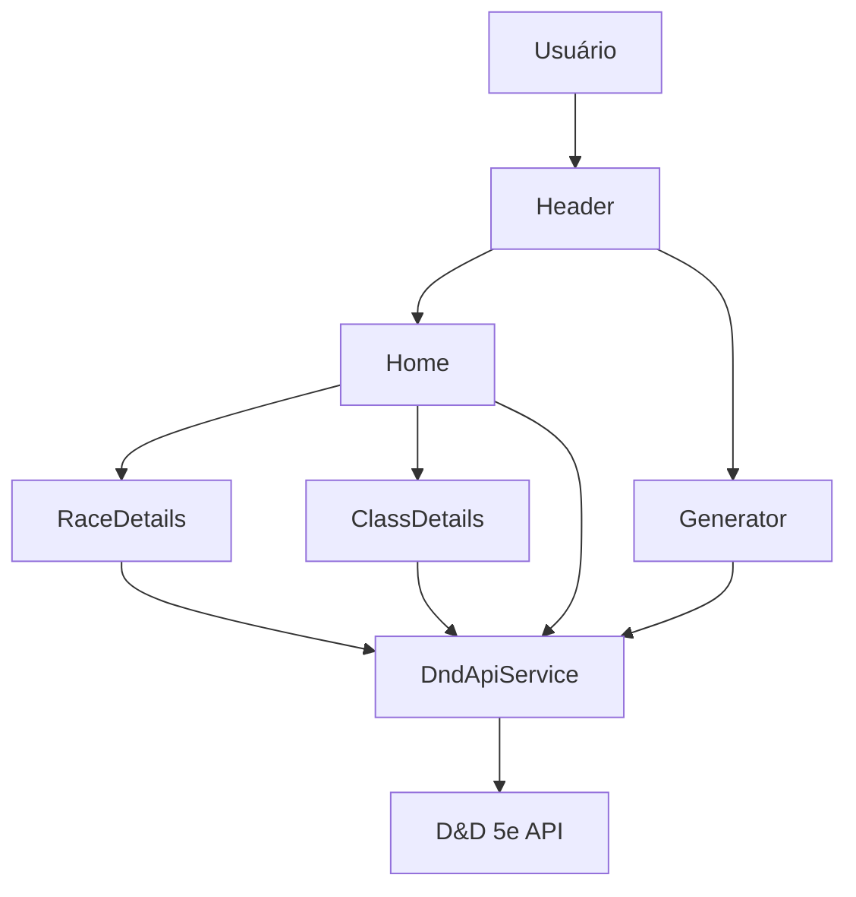
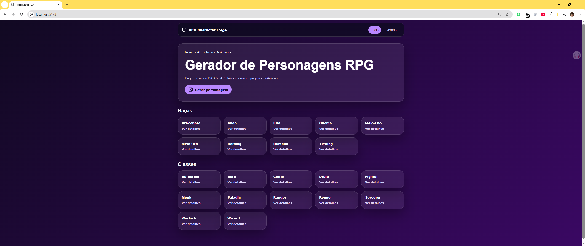
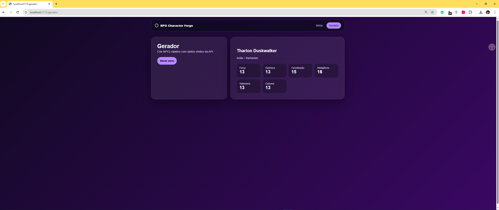
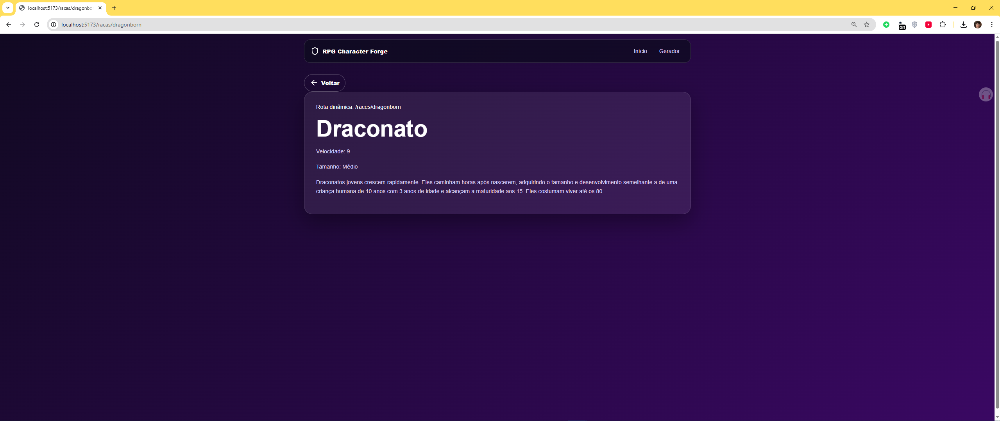
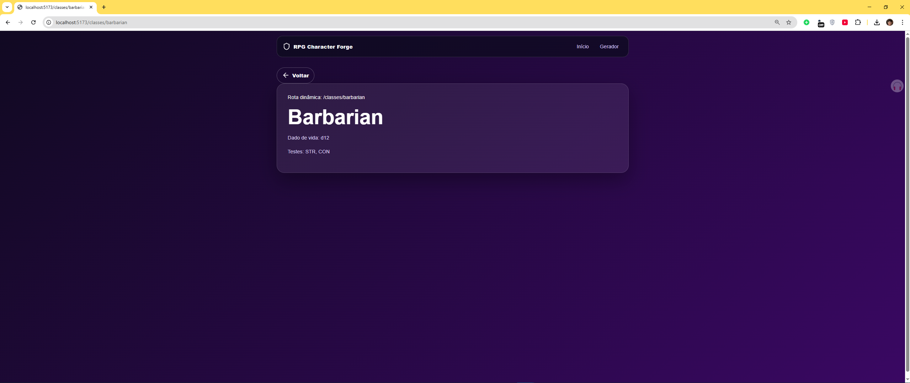

# RPG Character Forge React

Aplicação web desenvolvida em React para a disciplina de Desenvolvimento de Software para Web I.

O projeto consome a API pública D&D 5e API para listar raças e classes de RPG, além de possuir um gerador de personagens com nome, raça, classe e atributos. A aplicação também utiliza rotas dinâmicas com links internos para páginas de detalhes.

## Funcionalidades

- Consumir dados de API externa
- Listar raças disponíveis
- Listar classes disponíveis
- Acessar detalhes por rotas dinâmicas
- Gerar personagem de RPG automaticamente
- Exibir nome, raça, classe e atributos
- Página Not Found para rotas inexistentes
- Interface responsiva

## Tecnologias utilizadas

- React
- Vite
- JavaScript
- React Router DOM
- Fetch API
- Lucide React
- CSS3

## API utilizada

D&D 5e API

- https://www.dnd5eapi.co/api/2014/races
- https://www.dnd5eapi.co/api/2014/classes
- https://www.dnd5eapi.co/api/2014/races/:index
- https://www.dnd5eapi.co/api/2014/classes/:index

## Como executar o projeto

### 1. Clonar o repositório

git clone https://github.com/Pablo-Vitor/rpg-character-forge-react

### 2. Entrar na pasta

cd rpg-character-forge-react

### 3. Instalar dependências

npm install

### 4. Executar

npm run dev

### 5. Gerar build

npm run build

## Rotas da aplicação

- / — página inicial
- /gerador — gerador de personagem
- /racas/:index — detalhes de raça
- /classes/:index — detalhes de classe
- * — Not Found

## Arquitetura da aplicação



## Organização de pastas

```text
src/
├── main.jsx
├── style.css
└── páginas e rotas da aplicação
```

## Prints da aplicação


### Tela inicial



### Gerador de personagem



### Detalhes de raça



### Detalhes de classe



## Link para acessar a aplicação online

https://pablo-vitor.github.io/rpg-character-forge-react/

## Status do projeto

Projeto finalizado e funcional, atendendo aos requisitos de consumo de API externa, rotas dinâmicas com links internos, README, arquitetura, prints e deploy online.

## Autor

Pablo Vitor
